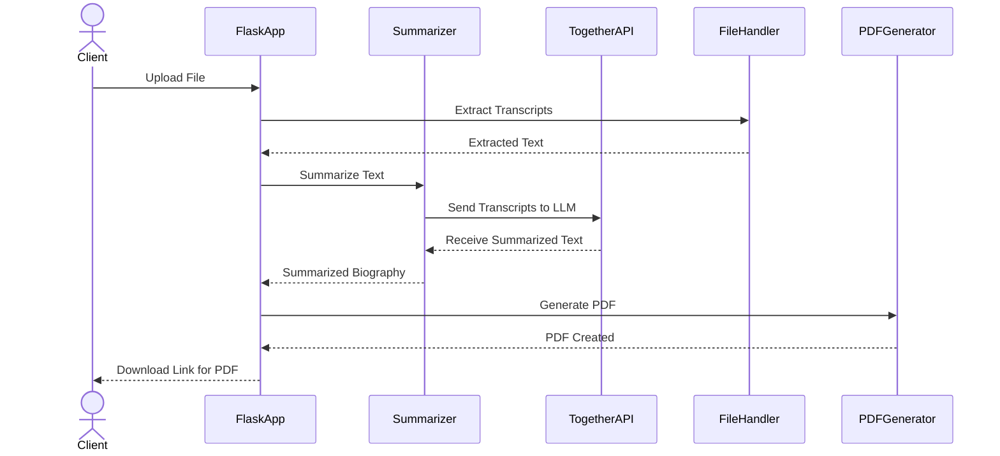

# German Biography Generator

## Table of Contents
1. [Introduction](#introduction)
2. [Architecture](#architecture)
3. [Flow Diagram](#flow-diagram)
4. [Configuration Parameters](#configuration-parameters)
5. [Setup and Installation](#setup-and-installation)
6. [Usage](#usage)
7. [Results](#results)
8. [Observations](#observations)
9. [Conclusions](#conclusions)
10. [References](#references)
11. [Future Scope](#future-scope)

---

## Introduction

This project is a web application that processes interview transcripts and generates structured biographies in German. It supports various file formats (CSV, DOCX, and PDF), extracts text, and then processes it using a large language model (LLM). The processed text is formatted into biographies and saved as downloadable PDF files. The application provides real-time feedback on processing status and supports concurrent uploads.

- **Input**: CSV, DOCX, or PDF files containing interview transcripts.
- **Output**: Downloadable PDF containing a formatted biography in German.

---

## Architecture

The application uses a modular architecture with distinct components for file uploading, text extraction, summarization, and PDF generation.

1. **Frontend**: 
   - A simple web interface for uploading files and displaying the processing status.
   
2. **Backend**: 
   - Flask-based application for handling file uploads, invoking the language model, and generating PDF files.
   
3. **Language Model**: 
   - Together API (`meta-llama/Meta-Llama-3.1-70B-Instruct-Turbo`) used to summarize interview transcripts into structured biographies.

4. **Real-Time Processing**: 
   - Flask-SocketIO provides real-time feedback during file processing.

---

## Flow Diagram



---

## Configuration Parameters


The application is controlled by a set of configuration parameters located in `./code/config.json`. Below is a summary of key parameters:

| Parameter              | Description                                                    | Type      | Default                    | Required |
|------------------------|----------------------------------------------------------------|-----------|----------------------------|----------|
| `uploads_folder`       | Directory path to store uploaded files                         | string    | `./uploads/`               | &#x2713; |
| `output_folder`        | Directory path to save generated PDFs                          | string    | `./output_pdfs/`           | &#x2718; |
| `max_tokens`           | Maximum tokens for LLM output                                  | integer   | 1024                       | &#x2718; |
| `use_cache`            | Whether to cache the LLM results                               | boolean   | True                       | &#x2718; |
| `llm_model_name`       | LLM model used for summarization                               | string    | `Meta-Llama-3.1-70B`       | &#x2713; |
| `together_api_key`     | API key for accessing Together LLM                             | string    | -                          | &#x2713; |
| `log_file_path`        | Path to store log file                                         | string    | `./logs/app.log`           | &#x2718; |
| `socket_io_enabled`    | Enable real-time updates using WebSockets                      | boolean   | True                       | &#x2718; |
| `allowed_extensions`   | File extensions allowed for upload                             | list      | `['csv', 'docx', 'pdf']`   | &#x2718; |
| `temp_folder`          | Temporary folder for intermediate files                        | string    | `./temp/`                  | &#x2718; |

---

## Setup and Installation

### Step 1: Clone the Repository
Clone this repository to your local machine:

```bash
git clone https://github.com/your-repo/transcript-summarizer.git
cd transcript-summarizer
```

### Step 2: Install the Required Libraries
Ensure you have Python 3.x installed. Install the necessary dependencies using the following command:

```bash
pip install -r requirements.txt
```

### Step 3: Configure the API Key
You will need an API key to access the `Together` language model. Update the `together_api_key` field in the configuration file with your actual API key.

```json
{
    "together_api_key": "your-together-api-key",
    ...
}
```

### Step 4: Create Required Directories
Ensure the following directories exist:

```bash
mkdir uploads output_pdfs logs temp
```

### Step 5: Run the Application
You can start the application by running:

```bash
python ./code/app.py
```

Open your browser and navigate to `http://127.0.0.1:5000` to interact with the web interface.

---

## Usage

1. **Upload**: Navigate to the web interface and upload a transcript file (CSV, DOCX, or PDF).
2. **Processing**: The application processes the file and provides real-time updates on progress.
3. **Download**: Once processed, a link is provided to download the generated PDF file containing the biography.

---

## Results

The application generates structured biographies in German based on interview transcripts. Below is a summary of the results:

- **Accuracy**: The generated biographies are faithful to the original interview transcripts.
- **Performance**: The application can process multiple files concurrently with a reasonable speed.
- **Formats**: The application supports CSV, DOCX, and PDF files.

### Sample Results:

- For a CSV file with multiple transcripts, the application outputs individual biographies for each transcript.
- For DOCX and PDF files, it extracts the full text and formats it into a biography.

---

## Observations

- **LLM Performance**: The language model efficiently generates coherent biographies in German based on the provided transcripts.
- **Speed**: Processing times vary depending on file size and content, but generally, results are generated within a few minutes.
- **Multi-file Support**: The application can handle multiple files simultaneously, making it suitable for bulk processing.

---

## Conclusions

- **Flexibility**: The application supports various file formats and handles different types of interview transcripts.
- **Efficiency**: The use of a large language model ensures high-quality outputs, with minimal manual intervention.
- **Real-time Feedback**: Users can track the status of their uploads through real-time updates, improving the overall experience.

---

## References

1. [Meta-Llama-3.1-70B-Instruct-Turbo](https://huggingface.co/meta-llama/Meta-Llama-3.1-70B-Instruct-Turbo)
2. [Together LLM](https://huggingface.co/together)
3. [Flask Documentation](https://flask.palletsprojects.com/en/2.0.x/)
4. [Flask-SocketIO Documentation](https://flask-socketio.readthedocs.io/en/latest/)
5. [PyPDF2 Documentation](https://pypdf2.readthedocs.io/en/latest/)

---

## Future Scope

- **Additional Languages**: Expand the application to support more languages for summarization.
- **More File Formats**: Add support for additional file formats, such as JSON and XML.
- **Unit Testing**: Introduce unit tests to ensure the code is functioning as expected.
- **Improved Error Handling**: Implement better error handling for failed file uploads and processing errors.
- **Edge Case Handling**: Handle edge cases such as broken or incomplete transcripts more robustly.

--- 

